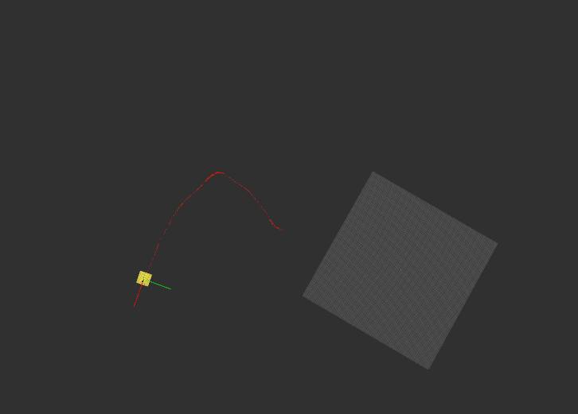

# How to test using example data for Fixposition ROS / ROS2 Driver

There is a sample TCP dump which is generated from the Fixposition Vision-RTK 2 sensor which can be used to test if the driver is working.

## we use `str2str` from `RTKLIB` to replay datastream on TCP port
  - Install RTKLIB: `sudo apt install rtklib`
  - The files are in `test/data`
    - `vrtk_output_1.txt` the tcp data stream
    - `vrtk_output_1.txt.tag` the timestamp file for the corresponding data stream
  - Replay the TCP stream:
    - `str2str -in file://vrtk2_output_1.txt::T -out tcpsvr://localhost:21000`
    - Adapt the IP and Port if needed
    - You can check with netcat `nc localhost 21000` to see if the data is properly replayed
    - For more details, see `str2str -h`

## How to test
- Compile the ROS driver
- configure the ROS driver's `tcp.yaml` to the corresponding IP and port from above.
- Start the ROS driver with
  - ROS1: `roslaunch  fixposition_driver_ros1 tcp.launch`
  - ROS2: `ros2 launch fixposition_driver_ros2 tcp.launch`
- For Visualization, start RVIZ with the provided RVIZ configuration in `fixposition_driver_ros1/rviz/fixposition_driver.rviz` or `fixposition_driver_ros2/rviz/fixposition_driver_ros2.rviz`
- You shall see something similar to this:
  
- Or capture the messages published by fixposition driver using  `rostopic echo <topic>` /  `ros2 topic echo <topic>`command

List of ros / ros2 topics

- ROS1: `rostopic list`
- ROS2: `ros2 topic list`
- then you should see

  ```
  /fixposition/corrimu
  /fixposition/imu_ypr
  /fixposition/navsatfix
  /fixposition/odometry
  /fixposition/odometry_enu
  /fixposition/poiimu
  /fixposition/rawimu
  /fixposition/speed
  /fixposition/vrtk
  /fixposition/ypr
  /tf
  /tf_static
  ```

and also echo the topics

- ROS1: `rostopic echo /fixposition/odometry`
- ROS2: `ros2 topic echo /fixposition/odometry`


```
header:
  seq: 3173
  stamp:
    secs: 1671488303
    nsecs: 752147983
  frame_id: "ECEF"
child_frame_id: "FP_POI"
pose:
  pose:
    position:
      x: 4278393.6861
      y: 636074.0115
      z: 4672249.8601
    orientation:
      x: 0.249904
      y: -0.255811
      z: 0.543161
      w: -0.759661
  covariance: [0.01508, -0.00352, -0.00264, 0.0, 0.0, 0.0, -0.00352, 0.01174, 0.00159, 0.0, 0.0, 0.0, -0.00264, 0.00159, 0.01604, 0.0, 0.0, 0.0, 0.0, 0.0, 0.0, 0.00045, 3e-05, 0.00023, 0.0, 0.0, 0.0, 3e-05, 0.00024, 6e-05, 0.0, 0.0, 0.0, 0.00023, 6e-05, 0.00036]
twist:
  twist:
    linear:
      x: 3.277
      y: 0.0535
      z: -0.0513
    angular:
      x: 0.00393
      y: -0.00585
      z: 0.03451
  covariance: [0.05008, 0.00475, 0.00146, 0.0, 0.0, 0.0, 0.00475, 0.06413, -0.00292, 0.0, 0.0, 0.0, 0.00146, -0.00292, 0.05633, 0.0, 0.0, 0.0, 0.0, 0.0, 0.0, 0.0, 0.0, 0.0, 0.0, 0.0, 0.0, 0.0, 0.0, 0.0, 0.0, 0.0, 0.0, 0.0, 0.0, 0.0]
```
Other topics:

`/fixposition/ypr`
```
x: -3.08980037375
y: -0.0306836361218
z: 0.0242531245715
```
`/fixposition/navsatfix`
```
header:
  seq: 2496
  stamp:
    secs: 1671544327
    nsecs: 933986893
  frame_id: "POI"
status:
  status: 0
  service: 0
latitude: 47.398651066
longitude: 8.460000567
altitude: 443.448
position_covariance: [1.3144, 0.26529, 0.0026386, 0.26529, 0.20829, 0.0003131, 0.0026386, 0.0003131, 0.072502]
position_covariance_type: 3
```

`/fixposition/poiimu`
```
header:
  seq: 129
  stamp:
    secs: 1671544394
    nsecs:  97284521
  frame_id: "FP_POI"
orientation:
  x: 0.0
  y: 0.0
  z: 0.0
  w: 0.0
orientation_covariance: [0.0, 0.0, 0.0, 0.0, 0.0, 0.0, 0.0, 0.0, 0.0]
angular_velocity:
  x: 0.00949
  y: 0.0017
  z: -0.09222
angular_velocity_covariance: [0.0, 0.0, 0.0, 0.0, 0.0, 0.0, 0.0, 0.0, 0.0]
linear_acceleration:
  x: 0.0643
  y: -0.524
  z: 9.8803
linear_acceleration_covariance: [0.0, 0.0, 0.0, 0.0, 0.0, 0.0, 0.0, 0.0, 0.0]
```

`/fixposition/imu_ypr`
```
x: 0.0
y: -0.0
z: 0.0
```

`/fixposition/odometry_enu`
```
header:
  seq: 172
  stamp:
    secs: 1671547910
    nsecs: 126985755
  frame_id: "FP_ENU0"
child_frame_id: "FP_POI"
pose:
  pose:
    position:
      x: -21.0624576159
      y: 86.8736442636
      z: -2.17882773687
    orientation:
      x: -0.00429835026653
      y: 0.0135503346719
      z: 0.980623523325
      w: 0.195386113884
  covariance: [0.01680222578893909, 0.00300224066714241, -0.00018696977599586342, 0.0, 0.0, 0.0, 0.00300224066714241, 0.02108652020855367, -0.0017258279185579117, 0.0, 0.0, 0.0, -0.00018696977599586342, -0.0017258279185579104, 0.03373125400250724, 0.0, 0.0, 0.0, 0.0, 0.0, 0.0, 0.0001549265219747773, 4.2393809056184216e-05, -1.712745803748877e-06, 0.0, 0.0, 0.0, 4.2393809056184216e-05, 0.0002442723978313275, 7.356418678410831e-05, 0.0, 0.0, 0.0, -1.7127458037488635e-06, 7.356418678410831e-05, 0.00019080108019389524]
twist:
  twist:
    linear:
      x: 4.5631
      y: -0.0224
      z: -0.0579
    angular:
      x: 0.00157
      y: 0.00936
      z: 0.01756
  covariance: [0.03885, 0.00642, -0.0015, 0.0, 0.0, 0.0, 0.00642, 0.05358, -0.00514, 0.0, 0.0, 0.0, -0.0015, -0.00514, 0.05575, 0.0, 0.0, 0.0, 0.0, 0.0, 0.0, 0.0, 0.0, 0.0, 0.0, 0.0, 0.0, 0.0, 0.0, 0.0, 0.0, 0.0, 0.0, 0.0, 0.0, 0.0]
```
